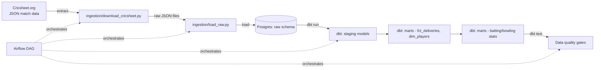

# 🏏 Cricket Analytics Data Pipeline

An end-to-end data engineering project that ingests real ball-by-ball cricket
data, models it into an analytics warehouse using **dbt**, orchestrates the
whole pipeline with **Apache Airflow**, and validates data quality with
automated tests on every push via **GitHub Actions CI**.

Built to demonstrate a modern ELT stack (Extract → Load → Transform) end to
end, on a dataset that's actually fun to explore: every ball bowled in every
match of a chosen competition (default: IPL), sourced from
[Cricsheet](https://cricsheet.org/), a free, open cricket statistics project.

---

## Why this project

Most portfolio pipelines use a toy CSV. This one:
- Ingests **real, messy, nested JSON** (Cricsheet's match format) — not a
  clean pre-flattened dataset.
- Models data through proper **staging → intermediate → marts** layers,
  the way production analytics engineering teams structure dbt projects.
- Has **dbt tests** (not_null, unique, relationships) wired into CI, so a
  bad model breaks the build — just like a real team's pipeline would.
- Is **orchestrated**, not just scripted — Airflow handles scheduling,
  retries, and task dependencies.
- Runs **locally with one command** (`docker-compose up`) so anyone
  reviewing your GitHub can actually run it, not just read the code.

---

## Architecture



**Stack:** Python · PostgreSQL · dbt-core · Apache Airflow · Docker Compose ·
GitHub Actions

No external dbt package dependencies (like `dbt_utils`) are required — the
one helper function used (surrogate key hashing) is implemented as a small
local macro in `dbt_project/macros/`, so `dbt run` works immediately with
no `dbt deps` step and no dependency on dbt's package hub being reachable.

---

## Project layout

```
cricket-data-pipeline/
├── ingestion/
│   ├── download_cricsheet.py   # Extract: pulls match JSONs from Cricsheet
│   └── load_raw.py             # Load: flattens JSON, loads into Postgres raw schema
├── dags/
│   └── cricket_pipeline_dag.py # Airflow DAG: extract -> load -> dbt run -> dbt test
├── dbt_project/
│   ├── models/staging/         # 1:1 cleaned views over raw tables
│   ├── models/marts/           # fact/dim tables + player stats marts
│   ├── seeds/                  # small sample dataset for CI (no internet needed)
│   └── dbt_project.yml
├── docker-compose.yml          # Postgres + Airflow, one command to run locally
├── .github/workflows/ci.yml    # Runs dbt build + tests on every push
└── requirements.txt
```

---

## Data model

**Staging layer** (`stg_matches`, `stg_deliveries`): light cleanup/renaming
directly over raw ingested tables, one row per delivery bowled.

**Marts layer**:
- `dim_players` — every unique player who has batted or bowled
- `dim_matches` — one row per match, with venue, teams, date, season
- `fct_deliveries` — the grain of the whole dataset: one row per ball bowled,
  foreign keys to players and matches
- `mart_batting_stats` — runs, balls faced, dismissals, strike rate, average
  per player per season
- `mart_bowling_stats` — wickets, runs conceded, overs bowled, economy rate
  per player per season

---

## Running it locally

**Prerequisites:** Docker + Docker Compose, Python 3.10+

```bash
# 1. Clone and enter the repo
git clone https://github.com/<your-username>/cricket-data-pipeline.git
cd cricket-data-pipeline

# 2. Install Python deps (for running ingestion scripts outside Airflow, optional)
pip install -r requirements.txt

# 3. Spin up Postgres + Airflow
docker-compose up -d

# 4. Open the Airflow UI
# http://localhost:8080  (default login: airflow / airflow)
# Trigger the "cricket_pipeline" DAG manually, or wait for its daily schedule

# 5. (Alternative) Run the pipeline manually without Airflow, for a quick look:
python ingestion/download_cricsheet.py --competition ipl --limit 20
python ingestion/load_raw.py
cd dbt_project
dbt run
dbt test
```

## Running just the dbt layer (fastest way to see the models)

The `dbt_project/seeds/` folder has a small sample dataset committed to the
repo so you can see the transformation layer without downloading anything:

```bash
cd dbt_project
pip install dbt-core dbt-postgres
# point dbt_project/profiles.yml.example at your Postgres instance and
# copy it to ~/.dbt/profiles.yml (see the file for details)

dbt seed        # loads sample_matches.csv, sample_deliveries.csv as raw.matches / raw.deliveries
dbt run         # builds staging + marts models
dbt test        # runs data quality tests (17 tests, all passing on sample data)
dbt docs generate && dbt docs serve   # browse the auto-generated data lineage docs
```

This exact sequence (`dbt seed` → `dbt run` → `dbt test`) has been run and
verified against a real Postgres instance — all 7 models build and all 17
tests pass on the committed sample data.

---

## What I'd extend next

- Swap Postgres for **Snowflake or BigQuery** to show cloud warehouse experience
- Add **Terraform** to provision the warehouse + IAM instead of docker-compose
- Add a small **Streamlit dashboard** on top of the marts (player comparison,
  season trends)
- Add **incremental dbt models** so re-runs only process new matches instead
  of full-refreshing every time

---

## About

Built by [Your Name] — Data Engineer with production experience in
Python, PySpark, SQL, and Azure Databricks. This project was built
specifically to get hands-on with dbt and Airflow orchestration.
